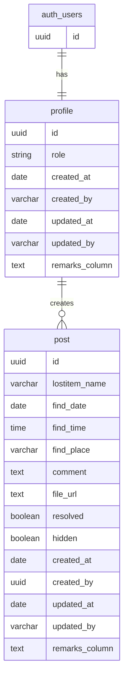

# ERD 図（Mermaid 形式・横長レイアウト）

```mermaid
erDiagram
    %% リレーションの定義（上に書くことで先に配置されやすい）
    auth_users ||--|| profile : has
    profile ||--o{ post : creates

    %% テーブル定義
    auth_users {
        uuid id
    }

    profile {
        uuid id
        string role
        date created_at
        varchar created_by
        date updated_at
        varchar updated_by
        text remarks_column
    }

    post {
        uuid id
        varchar lostitem_name
        date find_date
        time find_time
        varchar find_place
        text comment
        text file_url
        boolean resolved
        boolean hidden
        date created_at
        uuid created_by
        date updated_at
        varchar updated_by
        text remarks_column
    }
```
